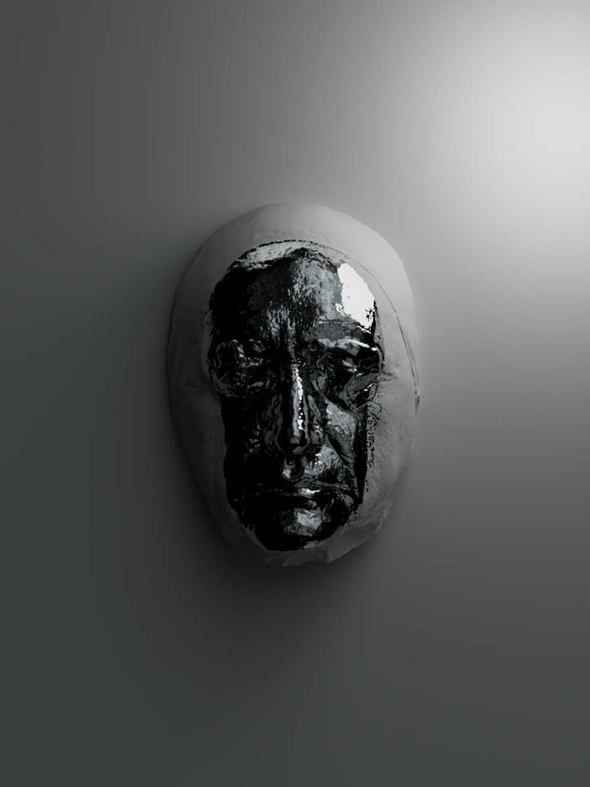

# Object Study

**A digital extension of physical works: playable, temporal, and shaped by touch.**

## The idea

Object Study is an interactive exhibition format for 3D artworks. The object remains the origin, but the screen changes how it can be encountered: viewers swipe through sequences, drag and rotate forms, pinch into details, and influence compositions in real time.

Instead of documenting physical work with a conventional portfolio grid, the project creates a spatial rhythm of entrances, loops, gestures, and pauses.

## Creative direction

The interface behaves like a dark gallery. Black space isolates each piece; restrained serif titles and compact technical labels sit above cinematic frames; glow, scale, and motion make rendered objects feel present without competing with them.

The interaction system is intentionally direct:

- swipe to move through the exhibition
- drag and pinch to inspect works
- tap to discover responsive behaviors
- switch between immersive and indexed views

## Works in the sequence

- Light Study
- Gohonzo Temple
- Romantizing the Habit
- Uroboros
- Grau Almighty
- Vincent's Day
- Composition Fall

## Role

Creative direction, 3D art, interaction concept, exhibition design, and implementation by [Tata Portal](https://tataportal.xyz).

## Technology

HTML, CSS, JavaScript, Three.js, GLB assets, rendered image sequences, touch gestures, and canvas physics.
